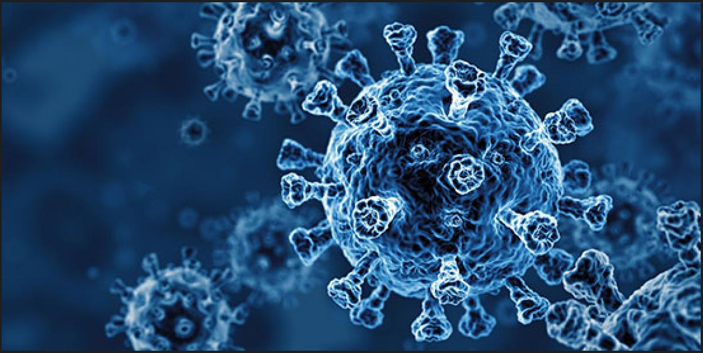

# COVID-19 Vaccination Analysis and Global Impact

Team Members - Hamim, Prav

### Project Description/Outline:
Our project aim is to analyse the number of COVID-19 vaccinations administered worldwide and if there is a correlation with GDP per capita.

### Research Questions:
1. How many people are partially vaccinated with only one dose of the COVID-19 vaccine per country in each continent?
2. What is the number of fully vaccinated individuals who have received both doses of the COVID-19 vaccine per country in each continent?       
3. Is there a correlation between the GDP per capita of a country and the percentage of its population that is partially vaccinated against COVID-19?  
4. What is the current global death toll due to COVID-19 (Map with Markers)?      

### Conclusion:

**Covid 19 Dashboard**

In conclusion, the vaccination progress varies across different countries or regions. Higher GDP per capita generally indicates better healthcare resources, which can contribute to higher vaccination rates. It would take further analysis to research in to why some countries achieved a higher level of vaccination coverage than others.

### Data Sets Used:
1. COVID-19 vaccination data: https://ourworldindata.org/covid-vaccinations
2. COVID-19 data: https://coronavirus.m.pipedream.net/

### References:
1. https://www.youtube.com/watch?v=g6cjhUhrhY8&ab_channel=LoreSoWhat
2. https://fonts.google.com/?preview.text=covid%2019&preview.text_type=custom&category=Display&sort=popularity

### Rough Breakdown of Tasks:
1. Data Collection: Gather data on COVID-19 vaccinations and global COVID-19 statistics from the provided sources.
2. Data Cleaning: Preprocess the data, handle missing values, and ensure consistency. 
3. Visualisation: Utilise JavaScript, particularly Leaflet.js, to create interactive visualizations showcasing the research questions.
4. Analysis: Analyse the data to answer the research questions and identify any correlations or insights.
5. Presentation: Create a presentation (on Powerpoint) summarising the findings and insights. 

### How to access the index.html
1. First download the folder called 'vaccine'.
2. Open you terminal and 'cd' into where the 'vaccine' folder is located in your computer.
3. Then in the terminal type in, 'python -m http.server'.
4. It should show, 'Serving HTTP on :: 8000'.
5. Go to your browser and type in the search bar, 'localhost8000'.
6. This will display the dashboard.
